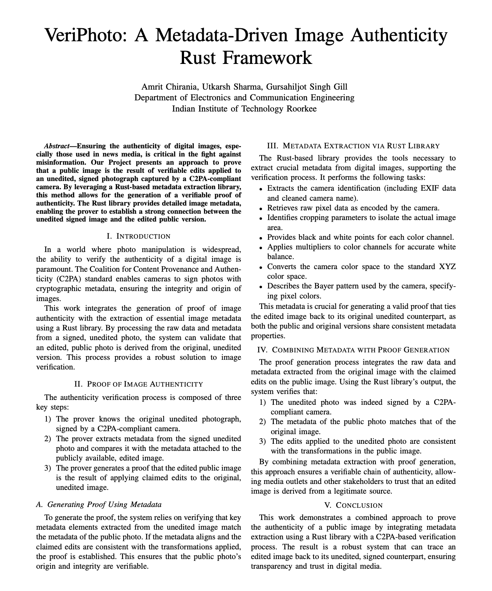
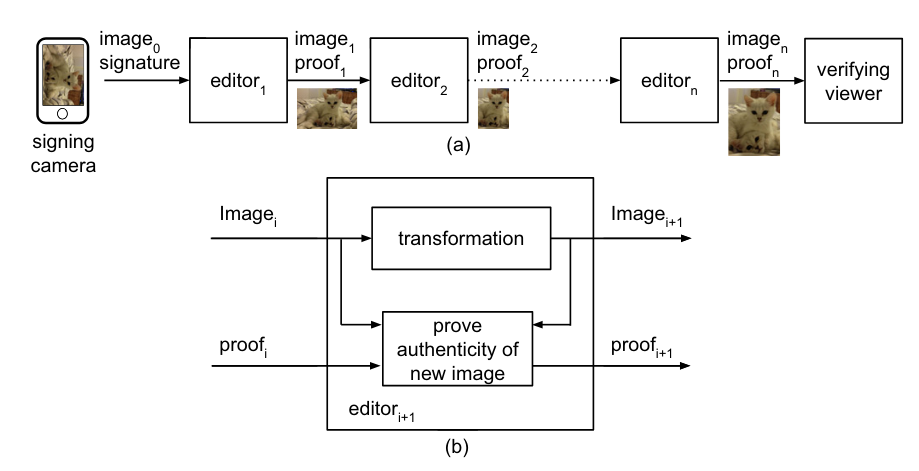
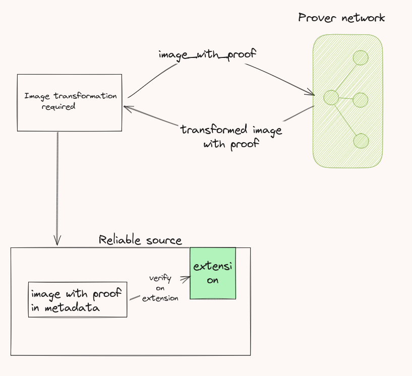

# **VeriPhoto**

## **Our project for Digital Image Processing Course (ECN-316)**

### **Initial Ideation**
Our initial idea for the project included limited core aspects of digital image processing (DIP). To better emphasize the subject matter, we refined our approach to focus more on DIP concepts.

---

## **Architecture**
The architecture of VeriPhoto is divided into two main parts

1. **Raw Decoding**  
2. **ZK-SNARKs Proof Generation**

---

### **1. Raw Decoding**
The process of transforming raw image data from camera sensors into a usable image format, ensuring maximum detail extraction and high-quality image processing.

- **Metadata Extraction**:
  - Extract essential metadata such as dimensions, compression methods, and camera settings.
  - Helps tailor the decoding process for each image file.

- **Handling Compression**:
  - Manage both lossless and lossy compression.
  - Apply standard decompression algorithms or camera-specific decoding methods.

- **Color Reconstruction**:
  - Decode Bayer pattern (mosaic of red, green, and blue pixels).
  - Use algorithms like demosaicing to reconstruct full-color images.

- **White Balance and Exposure Adjustment**:
  - Apply white balance corrections and exposure adjustments based on camera settings.
  - Ensure accurate color representation.

- **Image Reconstruction**:
  - We get the final PPM format and can encode it to standard formats
  - Reconstruct the raw data into standard formats like PNG or JPEG.
  - The final image is ready for further processing or display.

---

### **2. ZK-SNARKs Proof Generation**
Zk Snarks provide cryptographic guarnteee that an image has been transformed correctly. We use a recursive snark scheme. Inspired from [PhotoProof Assa Naveh and Eran Tromer](https://cs-people.bu.edu/tromer/papers/photoproof-oakland16.pdf)
The following scheme is used

## **Real-Life Use Cases**

- **Forensic Image Verification**:
  - Authenticate and validate raw image data integrity.

- **Digital Photography**:
  - Post-processing of raw photos for professional photographers.

- **Medical Imaging**:
  - Efficient decoding and processing of raw medical images like X-rays and MRIs.

- **Scientific Research**:
  -An image in an journal is not forged for fields where dip is essential.

- **Legal Evidence**:
  - Ensure the authenticity of digital image evidence in legal proceedings.

